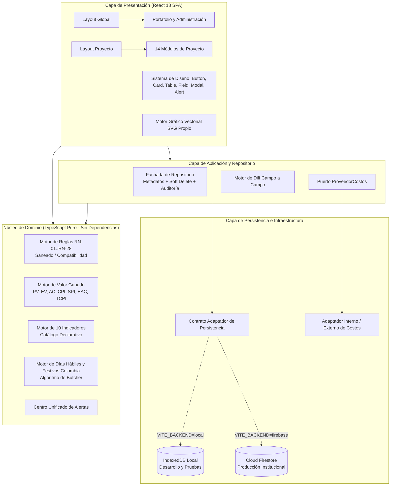
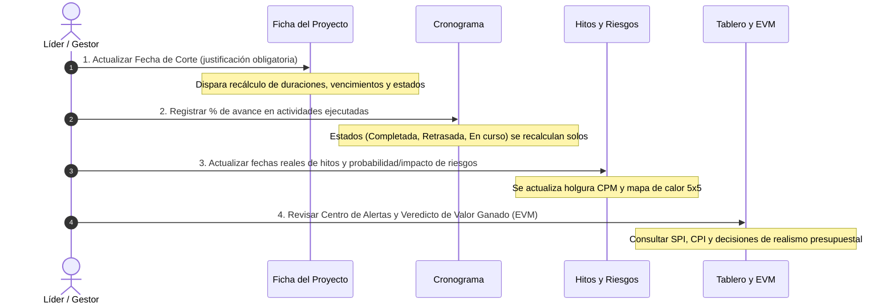

# HIGEP Web — Sistema de Gestión de Proyectos del IETS

<p align="center">
  
</p>

<p align="center">
  <strong>Plataforma Institucional para la Planificación, Seguimiento, Medición, Control y Auditoría de Proyectos</strong><br/>
  <em>Instituto de Evaluación Tecnológica en Salud (IETS) — Colombia</em>
</p>

<p align="center">
  <a href="./package.json"></a>
  <a href="https://react.dev/"></a>
  <a href="https://www.typescriptlang.org/"></a>
  <a href="https://vitejs.dev/"></a>
  <a href="https://vitest.dev/"></a>
  <a href="https://nodejs.org/"></a>
  <a href="https://www.iets.org.co/"></a>
  
</p>

---

## 📖 Resumen Ejecutivo

**HIGEP Web** es la solución tecnológica empresarial que moderniza y sustituye a la **Herramienta Institucional para la Gestión de Proyectos (HIGEP V2)**, instrumento histórico basado en un libro de Microsoft Excel de 17 hojas de trabajo interconectadas mediante macros y fórmulas locales.

La plataforma traslada la totalidad del marco metodológico institucional —definición, planeación operativa, gobierno y control, seguimiento de entregables, gestión de riesgos, satisfacción de usuarios, control presupuestal y trazabilidad— a un **entorno web colaborativo, multiusuario y multiproyecto**. 

A diferencia de una simple migración de pantallas, HIGEP Web soluciona de raíz las vulnerabilidades estructurales del modelo anterior:
1. **Concurrencia nativa sin bloqueos**: Múltiples analistas y líderes pueden trabajar simultáneamente sobre el mismo cronograma o matriz.
2. **Cálculos matemáticos soberanos**: Las fórmulas no están en celdas expuestas a edición accidental; se ejecutan en un motor determinístico desacoplado.
3. **Fecha de corte única y centralizada**: Elimina la duplicidad y desincronización histórica entre portadas y catálogos.
4. **Auditoría inmutable *append-only***: Cada mutación de campo queda registrada con autor, fecha/hora, valor anterior y nuevo.
5. **Seguridad RBAC institucional**: Autenticación estricta restringida al dominio corporativo `@iets.org.co` y perfiles con permisos granulares.
6. **Motor de Valor Ganado (EVM)**: Incorpora análisis de rendimiento financiero y cronológico con veredictos orientados a la toma de decisiones gerenciales.
7. **Motor gráfico vectorial propio**: Gráficas en SVG nativo sin librerías pesadas de terceros, con soporte de accesibilidad WCAG y tablas de datos gemelas.

---

## 📑 Tabla de Contenidos

- [1. Objetivos y Problemas Resueltos](#1-objetivos-y-problemas-resueltos)
- [2. Arquitectura Tecnológica y Patrones de Diseño](#2-arquitectura-tecnológica-y-patrones-de-diseño)
- [3. Estructura Exhaustiva del Repositorio](#3-estructura-exhaustiva-del-repositorio)
- [4. Catálogo de Módulos Funcionales (19 Módulos)](#4-catálogo-de-módulos-funcionales-19-módulos)
- [5. Motor de Reglas de Negocio (RN-01 a RN-28)](#5-motor-de-reglas-de-negocio-rn-01-a-rn-28)
- [6. Motor de Valor Ganado (EVM) y Capa de Costos](#6-motor-de-valor-ganado-evm-y-capa-de-costos)
- [7. Modo Doble de Cálculo y Prueba de Paridad](#7-modo-doble-de-cálculo-y-prueba-de-paridad)
- [8. Defectos Corregidos del Archivo Fuente (D-01 a D-18)](#8-defectos-corregidos-del-archivo-fuente-d-01-a-d-18)
- [9. Visualización de Datos y Sistema de Diseño](#9-visualización-de-datos-y-sistema-de-diseño)
- [10. Seguridad, Autenticación y Matriz RBAC](#10-seguridad-autenticación-y-matriz-rbac)
- [11. Guía de Instalación y Comandos de Desarrollo](#11-guía-de-instalación-y-comandos-de-desarrollo)
- [12. Modos de Persistencia (Local IndexedDB vs. Cloud Firebase)](#12-modos-de-persistencia-local-indexeddb-vs-cloud-firebase)
- [13. Manual Operativo y Rutina Semanal](#13-manual-operativo-y-rutina-semanal)
- [14. Enlaces a Documentación Especializada](#14-enlaces-a-documentación-especializada)

---

## 1. Objetivos y Problemas Resueltos

### 1.1. Matriz Comparativa: Excel vs. HIGEP Web

| # | Problema Histórico en Excel (HIGEP V2) | Solución Definitiva en HIGEP Web |
|---|---|---|
| **P1** | **Un archivo por proyecto**: Imposibilidad de consolidar un portafolio institucional en tiempo real sin consolidaciones manuales. | **Modelo multiproyecto centralizado**: portafolio dinámico con filtros por líder, vigencia, estado, riesgos críticos y curva de avance. |
| **P2** | **Sobrescritura accidental de fórmulas**: Celdas con fórmulas complejas podían ser borradas o alteradas por usuarios operativos. | **Lógica de cálculo protegida**: las fórmulas son funciones puras inalterables. Los campos calculados no admiten entrada en interfaz ni API. |
| **P3** | **Trazabilidad manual**: La hoja *Registro de actualizaciones* requería anotación manual voluntaria, perdiéndose el historial real. | **Auditoría inmutable *append-only***: se genera un evento auditable automático por cada campo modificado con *diff* visual. |
| **P4** | **Carencia de control de acceso**: Quien tenía el archivo poseía acceso total a costos, sueldos y fichas. | **Control de acceso basado en roles (RBAC)** con verificación en el cliente y en el servidor. Restricción estricta a `@iets.org.co`. |
| **P5** | **Bloqueo de archivo por concurrencia**: Archivo inaccesible o bloqueado si otro miembro del equipo lo abría en red. | **Escritura concurrente multiusuario** con persistencia reactiva, soporte de transacciones y estados de recálculo no bloqueantes. |
| **P6** | **Dispersión de versiones**: Múltiples copias del libro navegando por correo y carpetas locales sin claridad de cuál era la vigente. | **Fuente única de verdad**: base de datos centralizada con fechas de corte y versiones históricas (instantáneas *snapshots*). |
| **P7** | **Fecha de corte y avance desincronizados**: Cálculos erráticos por coexistencia de fechas dispares en carátula y parámetros. | **Fecha de corte única soberana** por proyecto: al actualizarla, el motor recalcula automáticamente todo el cronograma, hitos e indicadores. |
| **P8** | **Limitaciones de rango rígido**: Espacio predeterminado fijo (25 actividades, 11 riesgos, 4 recursos); ampliarlo rompía fórmulas de matrices. | **Capacidad sin topes fijos**: cualquier proyecto puede gestionar cientos de actividades, riesgos y entregables sin límites artificiales. |

### 1.2. Principios Funcionales No Negociables

1. **Unicidad de captura:** Cada dato se registra en su módulo natural; la información nunca se duplica ni se transcribe entre pantallas.
2. **Inalterabilidad de resultados:** Ningún campo derivado (duraciones, estados, severidades, holguras, valores ganados) es editable directamente. Para ajustar una métrica se debe corregir el dato fuente que la origina.
3. **Soberanía de la fecha de corte:** Todo análisis de avance, desviación y semaforización responde con exactitud a la fecha de corte configurada en la Ficha del Proyecto.
4. **Trazabilidad sin excepciones:** Ningún cambio de fecha, estado o valoración pasa desapercibido. Los cambios sensibles exigen comentario de justificación.
5. **Gobierno por listas controladas:** Las clasificaciones se eligen de catálogos normalizados; se prohíbe el ingreso de cadenas libres en campos tipificados.

---

## 2. Arquitectura Tecnológica y Patrones de Diseño

HIGEP Web está diseñado bajo los principios de la **Arquitectura Hexagonal (Puertos y Adaptadores)** y **Clean Architecture**.



### 2.1. Decisiones de Arquitectura Documentadas (ADRs)

| ID | Decisión | Justificación Técnica | Consecuencia en el Código |
|---|---|---|---|
| **ADR-01** | **SPA en React + TypeScript con Vite** | Interacción intensiva en navegador (Gantt interactivo, edición matricial RACI, mapas de calor 5x5). | Estado del servidor gobernado mediante React Context y caché local reactiva. |
| **ADR-02** | **Persistencia Dual (IndexedDB / Firestore)** | Desarrollo y demostración autónomos sin necesidad de conexión ni cuenta de nube; producción corporativa con Firestore. | La aplicación interactúa exclusivamente contra la interfaz `Adaptador`; cero acoplamiento a librerías de base de datos en UI. |
| **ADR-03** | **Cálculos derivados desacoplados y no editables** | Evitar la manipulación arbitraria de resultados y discrepancias entre clientes. | Los resultados de cálculo no tienen endpoints ni rutas de mutación en la base de datos. |
| **ADR-04** | **Autenticación restringida con Google institucional** | Reutilizar el directorio activo corporativo sin gestionar contraseñas ni almacenamiento de credenciales sensibles. | La función Cloud Function `bloqueoDeAcceso` deniega el acceso a nivel de servidor a cuentas ajenas a `@iets.org.co`. |
| **ADR-05** | **Roles y permisos RBAC verificados en doble vía** | Privilegio mínimo: la interfaz oculta/deshabilita controles; las reglas de seguridad de Firestore bloquean escrituras no autorizadas. | Matriz centralizada en `src/auth/permisos.ts` y réplica normativa en `firestore.rules`. |
| **ADR-06** | **Auditoría inmutable *append-only*** | Trazabilidad legal y regulatoria inalterable; ningún usuario (ni siquiera administradores) puede borrar o editar auditoría. | Tabla histórica protegida con reglas de solo adición (`allow create, read; allow update, delete: if false;`). |
| **ADR-07** | **Catálogos y parámetros alojados en datos** | Reproduce la hoja *Parámetros y listas* permitiendo ajustar umbrales y opciones sin compilar ni desplegar código. | Pantalla de administración protegida (`/admin/catalogos`) con control de cambios auditado. |
| **ADR-08** | **Catálogo declarativo de indicadores** | Permitir incorporar nuevos indicadores combinando métricas existentes mediante fórmulas registradas. | Módulo `src/domain/indicadores.ts` basado en mapeadores de fórmula (`formulaClave`). |
| **ADR-09** | **Baja lógica (*Soft Delete*) universal** | Preservar la integridad referencial histórica y habilitar la restauración de elementos eliminados por error. | Toda consulta filtra por `eliminado !== true`; los registros retienen `eliminadoPor` y `eliminadoEn`. |
| **ADR-10** | **Capa de Costos desacoplada (`ProveedorCostos`)** | Permitir la transición futura hacia el software contable o ERP institucional sin reescribir tableros ni valor ganado. | Todo consumo financiero invoca la interfaz `ProveedorCostos`, permitiendo alternar entre el módulo de presupuesto interno o un conector externo. |

---

## 3. Estructura Exhaustiva del Repositorio

```text
Sistema-de-Gestion-de-Proyectos-del-IETS/
├── .github/
│   └── workflows/
│       └── ci.yml                 # Pipeline CI: verificación de tipos, compilación y pruebas en cada PR
├── docs/                          # Documentación técnica extendida
│   ├── DESPLIEGUE.md              # Guía completa de despliegue en Google Cloud y Firebase
│   ├── MANUAL.md                  # Manual operativo y procedimiento de rutina semanal por rol
│   ├── REGLAS.md                  # Especificación formal de las 28 reglas de negocio (fórmulas y pruebas)
│   ├── TRAZABILIDAD.md            # Matriz de trazabilidad: épicas → código fuente → pruebas unitarias
│   └── VALOR_GANADO.md            # Marco teórico, fórmulas EVM y especificación del contrato de costos
├── functions/                     # Backend serverless (Firebase Cloud Functions)
│   └── src/
│       └── index.ts               # Blocking function para restricción de dominio @iets.org.co
├── frontend/                      # Aplicación cliente web SPA (React + TypeScript)
│   ├── index.html                 # Punto de entrada HTML con meta-tags institucionales
│   ├── package.json               # Dependencias del cliente y scripts de ejecución
│   ├── tsconfig.json              # Reglas estrictas de compilación TypeScript
│   ├── vite.config.ts             # Configuración de empaquetado, alias (@/) y división de chunks
│   ├── vitest.config.ts           # Configuración del entorno de pruebas unitarias
│   ├── .env.example               # Plantilla de variables de entorno para frontend
│   └── src/
│       ├── main.tsx               # Montaje del árbol de componentes React
│       ├── App.tsx                # Enrutador central, Suspense y proveedor de inicialización
│       ├── app/                   # Shell de layout y contexto del proyecto
│       │   ├── LayoutGlobal.tsx   # Envoltorio para vistas institucionales (Header + Sidebar)
│       │   ├── LayoutProyecto.tsx # Envoltorio con cabecera de proyecto, fecha de corte y submenú
│       │   ├── ProyectoContext.tsx# Contexto reactivo que carga y recalcula los datos del proyecto activo
│       │   ├── navegacion.tsx     # Mapa único centralizado de rutas y contadores de alerta
│       │   └── usePortafolio.ts   # Hook para agregaciones estadísticas de todos los proyectos
│       ├── auth/                  # Capa de seguridad y autenticación
│       │   ├── AuthContext.tsx    # Proveedor de sesión, login con Google y simulador de roles
│       │   └── permisos.ts        # Matriz RBAC (24 acciones x 6 roles) y guardas de acceso
│       ├── components/            # Sistema de diseño UI reutilizable (un botón, una tabla, un campo)
│       │   ├── Alert.tsx          # Avisos informativos, de advertencia, error y éxito
│       │   ├── Badge.tsx          # Etiquetas de estado semánticas con puntos de actividad
│       │   ├── Button.tsx         # Botón único con soporte para variantes, tamaños y estados de carga
│       │   ├── Card.tsx           # Tarjetas estructuradas con título, subtítulo y acciones
│       │   ├── Dashboard/         # Componentes de tablero (KPICard con acentos e indicadores)
│       │   ├── EstadoVista.tsx    # Vistas estándar de Cargando, Error y Estado Vacío
│       │   ├── Header.tsx         # Cabecera institucional con selector de perfil y menú responsivo
│       │   ├── Progreso.tsx       # Barras de progreso de avance con degradados semánticos
│       │   ├── Sidebar.tsx        # Navegación lateral colapsable con badges de alerta reactivos
│       │   ├── Tabs.tsx           # Pestañas de navegación de contenido
│       │   ├── Toast.tsx          # Sistema de notificaciones flotantes temporizadas
│       │   ├── charts/            # MOTOR GRÁFICO VECTORIAL PROPIO (SVG puro)
│       │   │   ├── index.tsx      # Figuras compuestas, leyendas y tablas gemelas accesibles
│       │   │   ├── paleta.ts      # Paletas accesibles validadas para daltonismo (WCAG AAA)
│       │   │   ├── avanzados.tsx  # Curva S, Cascada presupuestal, Cuadrante EVM, Pareto de riesgos
│       │   │   └── reparto.tsx    # Donas de distribución, barras agrupadas y línea temporal de hitos
│       │   ├── icons/             # Colección de iconos vectoriales SVG de 24x24 px (trazo uniforme)
│       │   └── ui/                # Controles de interfaz (Field, Input, Select, Textarea, Modal, Table)
│       ├── domain/                # MOTOR DE DOMINIO Y LÓGICA DE NEGOCIO PURA
│       │   ├── types.ts           # Definición formal de tipos y modelos de datos
│       │   ├── reglas.ts          # Implementación de las 28 reglas de negocio (RN-01 a RN-28)
│       │   ├── indicadores.ts     # Fórmulas de cálculo de los 10 indicadores institucionales
│       │   ├── evm.ts             # Motor de Valor Ganado (Earned Value Management)
│       │   ├── costos.ts          # Contrato ProveedorCostos y adaptador de costos
│       │   ├── fechas.ts          # Calendario laboral de Colombia, festivos por ley y días hábiles
│       │   ├── catalogos.ts       # Valores por defecto y listas controladas del sistema
│       │   └── alertas.ts         # Centro unificado de alertas e integridad referencial
│       ├── data/                  # CAPA DE ACCESO A DATOS (PERSISTENCIA TRAS CONTRATO)
│       │   ├── adapter.ts         # Contrato Adaptador y generador determinístico de rutas de colección
│       │   ├── backend.ts         # Detección de backend activo (local vs. firebase)
│       │   ├── localAdapter.ts    # Adaptador IndexedDB reactivo para desarrollo autónomo
│       │   ├── firebaseAdapter.ts # Adaptador Cloud Firestore para producción
│       │   ├── repo.ts            # Fachada de escritura: metadatos, baja lógica, auditoría y recálculo
│       │   ├── auditoria.ts       # Calculador de diff campo a campo y detector de campos sensibles
│       │   └── seed.ts            # Siembra de catálogos y datos sintéticos de demostración
│       ├── lib/                   # Librerías auxiliares
│       │   ├── exportar.ts        # Motor de exportación a Excel (.xlsx multihoja) y CSV UTF-8 BOM
│       │   └── formato.ts         # Formateo de moneda colombiana ($ COP), porcentajes y fechas ISO
│       ├── modules/               # MÓDULOS DE NEGOCIO Y VISTAS DE PANTALLA
│       │   ├── Login.tsx          # Acceso institucional y selector de perfiles demo
│       │   ├── portafolio/        # Portafolio institucional de proyectos
│       │   ├── dashboard/         # Dashboard Ejecutivo del proyecto
│       │   ├── tablero/           # Tablero de seguimiento y curva S
│       │   ├── proyectos/         # Ficha del proyecto y listado de proyectos
│       │   ├── equipo/            # Grupo desarrollador y vinculaciones
│       │   ├── cronograma/        # Cronograma tabular con cálculo de duraciones
│       │   ├── gantt/             # Diagrama de Gantt cronológico
│       │   ├── hitos/             # Hitos, ruta crítica (CPM) y entregables
│       │   ├── raci/              # Matriz RACI con validación de Accountable único
│       │   ├── riesgos/           # Matriz de riesgos y mapa de calor 5x5
│       │   ├── recursos/          # Gestión de insumos y recursos logísticos
│       │   ├── productos/         # Control de calidad y conformidad de productos
│       │   ├── satisfaccion/      # Registro de satisfacción de partes interesadas
│       │   ├── presupuesto/       # Control presupuestal y ejecución financiera
│       │   ├── indicadores/       # Panel analítico de indicadores calculados
│       │   ├── auditoria/         # Consulta de eventos de auditoría (global y de proyecto)
│       │   ├── catalogos/         # Administración de listas, parámetros, festivos y usuarios
│       │   └── importacion/       # Importación, exportación y prueba de paridad numérica
│       └── styles/                # SISTEMA DE DISEÑO Y ESTILOS
│           ├── theme.ts           # Design tokens tipados (colores, espaciados, bordes, sombras)
│           ├── globals.css        # Reset CSS, fuentes del sistema y variables CSS nativas
│           └── components.css     # Clases maestras del sistema de diseño (hg-*)
├── .env.example                   # Plantilla de variables de entorno para la raíz
├── .gitignore                     # Exclusión universal para monorepositorio
├── .nvmrc                         # Versión oficial fijada de Node.js (v20)
├── HIGEP_Web_Backlog_Tecnologico.md # Especificación técnica, reglas (RN) y épicas (EP)
├── linea-grafica-y-ux-ui.md       # Sistema de diseño, guía UX/UI y tokens visuales
├── package.json                   # Configuración de workspaces de monorepositorio y scripts raíz
└── README.md                      # Esta documentación maestra
```

---

## 4. Catálogo de Módulos Funcionales (19 Módulos)

HIGEP Web implementa de forma exhaustiva las 17 hojas de trabajo de HIGEP V2 más las capacidades de portafolio y administración que el libro de cálculo no permitía:

| Módulo | Ruta URL | Hoja Excel Origen | Permiso Mínimo | Funcionalidad Principal |
|---|---|---|---|---|
| **Portafolio Institucional** | `/portafolio` | *(No existía en Excel)* | `portafolio.ver` | Consolidación global de proyectos, avance promedio, filtros por vigencia/líder y alerta temprana de proyectos críticos. |
| **Listado de Proyectos** | `/proyectos` | *Portafolio* | Consulta | Directorio de proyectos a los que el usuario tiene acceso, con estado de ciclo de vida (Borrador, Activo, Cerrado). |
| **Auditoría del Sistema** | `/auditoria` | *Reg. Actualizaciones* | `auditoria.ver` | Registro histórico transversal append-only de modificaciones sobre catálogos, accesos y proyectos. |
| **Catálogos y Parámetros** | `/admin/catalogos` | *Parámetros y listas* | `catalogos.editar` | Gestión de vocabularios controlados, umbrales de alerta y calendario nacional de días no laborables (festivos). |
| **Catálogo de Indicadores** | `/admin/indicadores` | *Indicadores* | `catalogos.editar` | Administración de metas, fórmulas declarativas, frecuencias y criterios de semaforización institucional. |
| **Usuarios y Roles** | `/admin/usuarios` | *(No existía en Excel)* | `usuarios.administrar` | Directorio de usuarios autorizados, activación de cuentas y asignación de roles institucionales y locales. |
| **Dashboard Ejecutivo** | `/proyectos/:id/dashboard` | *Dashboard ejecutivo* | Consulta | Lectura gerencial rápida: avance ponderado vs. esperado, semáforo de desviación, métricas de riesgo y costos. |
| **Tablero de Seguimiento** | `/proyectos/:id/tablero` | *Tablero de seguimiento* | Consulta | Centro de seguimiento operativo, avance por fases, curva S y listado dinámico de alertas de gestión activas. |
| **Panel de Indicadores** | `/proyectos/:id/indicadores`| *Indicadores / Dash. Ind.*| Consulta | Resultados en vivo de los 10 indicadores institucionales calculados frente a sus metas, con histórico y justificación. |
| **Ficha del Proyecto** | `/proyectos/:id/ficha` | *Ficha del proyecto* | `proyecto.ver` | Datos generales, marco metodológico, objetivos específicos, productos comprometidos y **fecha de corte soberana**. |
| **Grupo Desarrollador** | `/proyectos/:id/equipo` | *Grupo desarrollador* | `equipo.editar` | Registro de miembros del equipo, perfil, vinculación institucional, dedicación en horas/mes y estado contractual. |
| **Cronograma** | `/proyectos/:id/cronograma` | *Cronograma* | `cronograma.editar` | Lista jerárquica de actividades por fase, cálculo de días hábiles reales, % de avance y edición masiva de tabla. |
| **Diagrama de Gantt** | `/proyectos/:id/gantt` | *Gantt* | Consulta | Representación visual cronológica de barras por semanas y meses, sincronizada con la fecha de corte. |
| **Hitos y Ruta Crítica** | `/proyectos/:id/hitos` | *Hitos y ruta crítica* | `hitos.editar` | Control de hitos contractuales, cálculo automático de holgura por el método CPM y alertas de entregables próximos. |
| **Matriz RACI** | `/proyectos/:id/raci` | *Matriz RACI* | `raci.editar` | Asignación de responsabilidades (R, A, C, I) por actividad con auditoría automática de integridad (exactamente un *A*). |
| **Matriz de Riesgos** | `/proyectos/:id/riesgos` | *Matriz de riesgos* | `riesgos.editar` | Calificación de probabilidad (1..5) e impacto (1..5), mapa de calor matricial interactivo 5x5 y planes de mitigación. |
| **Recursos e Insumos** | `/proyectos/:id/recursos` | *Recursos e insumos* | `recursos.editar` | Inventario de insumos humanos, tecnológicos y logísticos con control de disponibilidad y alertas por gestionar. |
| **Registro de Productos** | `/proyectos/:id/productos` | *Registro de productos* | `productos.editar` | Registro de entregables intermedios y finales, evaluación formal de calidad y estado booleano de conformidad. |
| **Medición de Satisfacción**| `/proyectos/:id/satisfaccion`| *Registro de satisfacción*| `satisfaccion.editar`| Registro de encuestas y evaluaciones de usuarios y partes interesadas, con cálculo de índices de aprobación. |
| **Control Presupuestal** | `/proyectos/:id/presupuesto` | *Control presupuestal* | `presupuesto.editar` | Ejecución periódica por rubro y fuente financiera, cálculo de desviaciones absolutas/porcentuales y conexión EVM. |
| **Auditoría del Proyecto** | `/proyectos/:id/auditoria` | *Reg. Actualizaciones* | `auditoria.ver` | Bitácora inmutable de eventos exclusivos del proyecto activo, con filtros por entidad, usuario y tipo de cambio. |
| **Importar y Exportar** | `/proyectos/:id/importacion`| *(Transversal)* | `datos.exportar` | Exportación completa a Excel (.xlsx multihoja), exportación a CSV, importación guiada y **prueba de paridad numérica**. |

---

## 5. Motor de Reglas de Negocio (RN-01 a RN-28)

Todas las reglas están codificadas como **funciones puras** en [`frontend/src/domain/reglas.ts`](./frontend/src/domain/reglas.ts):

### 5.1. Reglas Operativas de Cronograma y Tiempo

- **RN-01 (Determinación del Estado de la Actividad):**
  Aplica el orden de precedencia estricto heredado de HIGEP V2 donde la finalización prevalece sobre el desfase temporal:
  $$\text{Estado} = \begin{cases} 
  \text{"Completada"} & \text{si } \text{Avance} \ge 100\% \\
  \text{"Retrasada"} & \text{si } \text{FechaCorte} > \text{FechaFin} \land \text{Avance} < 100\% \\
  \text{"En curso"} & \text{si } \text{FechaCorte} \ge \text{FechaInicio} \land \text{Avance} < 100\% \\
  \text{"Pendiente"} & \text{en cualquier otro caso}
  \end{cases}$$
  *Guarda de fila vacía (D-14):* Si la fila carece de nombre o fechas válidas, el motor la excluye de los agregados para no viciar el denominador del avance ponderado.

- **RN-02 (Cálculo de Duración en Días Hábiles Reales):**
  Supera la resta calendario fija del Excel (`fin - inicio - 2`). El cálculo evalúa el intervalo cerrado $[FechaInicio, FechaFin]$ excluyendo sábados, domingos y los días festivos nacionales calculados para Colombia mediante la **Ley 51 de 1983 (Ley Emiliani)** y el algoritmo astronómico de Butcher para determinar el Domingo de Pascua (18 festivos anuales calculados dinámicamente). Duración mínima de 1 día hábil para actividades válidas.

- **RN-04 (Avance Global Ponderado del Proyecto):**
  Calcula el progreso físico real como el promedio ponderado del avance de cada actividad respecto a su duración hábil:
  $$\text{Avance Ponderado} = \frac{\sum_{i=1}^{n} (\text{Avance}_i \times \text{DuraciónHabil}_i)}{\sum_{i=1}^{n} \text{DuraciónHabil}_i}$$

- **RN-05 (Avance Esperado a la Fecha de Corte):**
  Corrige la distorsión del Excel original (D-02) que mezclaba unidades calendario y días hábiles:
  $$\text{Avance Esperado} = \frac{\sum_{i=1}^{n} \text{DuraciónTranscurridaHabil}_i}{\sum_{i=1}^{n} \text{DuraciónHabil}_i} \times 100\%$$
  Donde las actividades vencidas aportan su duración hábil total y las actividades en curso aportan únicamente los días hábiles transcurridos hasta la fecha de corte. El avance esperado nunca excede el 100 %.

- **RN-06 (Desviación del Avance y Semáforos):**
  $$\text{Desviación} = \text{Avance Ponderado Real} - \text{Avance Esperado}$$
  - $\text{Desviación} \ge -5\%$ $\rightarrow$ **Normal (Verde)**.
  - $-10\% \le \text{Desviación} < -5\%$ $\rightarrow$ **Precaución (Amarillo)**.
  - $\text{Desviación} < -10\%$ $\rightarrow$ **Crítico / Atención (Rojo)**.
  *(Los umbrales provienen del catálogo de parámetros del sistema, no de valores fijos).*

- **RN-10 (Proximidad de la Entrega Final):**
  Calcula la proximidad de la fecha fin del proyecto contra la fecha de corte usando la ventana dinámica del catálogo (por defecto 14 días calendario, corrigiendo el valor cableado de 21 días del Excel).

### 5.2. Reglas de Gestión de Riesgos

- **RN-12 y RN-13 (Severidad y Nivel de Riesgo):**
  $$\text{Severidad} = \text{Probabilidad (1..5)} \times \text{Impacto (1..5)}$$
  - Severidad 1 a 4: **Nivel Bajo** (Verde).
  - Severidad 5 a 9: **Nivel Medio** (Amarillo).
  - Severidad 10 a 14: **Nivel Alto** (Naranja).
  - Severidad 15 a 25: **Nivel Crítico** (Rojo).

### 5.3. Reglas de Gobierno y Medición

- **RN-17 a RN-19 (Integridad de la Matriz RACI):**
  Cada actividad debe contar de forma estricta con **exactamente un único responsable ejecutor (*A - Accountable*)**. El sistema emite alertas de integridad automáticas cuando una actividad carece de *A* o tiene múltiples personas asignadas a ese rol.
- **RN-24 y RN-25 (Semaforización de Indicadores Institucionales):**
  Evalúa el cumplimiento según el sentido del indicador:
  - *Mayor es mejor:* Cumple si $\text{Valor} \ge \text{Meta}$; Atención si $\text{Valor} \ge \text{Meta} \times \text{FactorAtenciónMayor}$ (0.9); Crítico en caso contrario.
  - *Menor es mejor:* Cumple si $\text{Valor} \le \text{Meta}$; Atención si $\text{Valor} \le \text{Meta} \times \text{FactorAtenciónMenor}$ (2.0); Crítico en caso contrario.

---

## 6. Motor de Valor Ganado (EVM) y Capa de Costos

Ubicado en [`frontend/src/domain/evm.ts`](./frontend/src/domain/evm.ts) y documentado exhaustivamente en [`docs/VALOR_GANADO.md`](./docs/VALOR_GANADO.md).

HIGEP Web va más allá de un registro contable pasivo. Integra un motor de **Gestión de Valor Ganado (Earned Value Management)** que traduce avance físico y financiero a un lenguaje homogéneo para comités directivos:

### 6.1. Magnitudes y Métricas Fundamentales

| Métrica | Sigla | Significado Conceptual | Fórmula Matemática |
|---|---|---|---|
| **Presupuesto al Cierre** | **BAC** | Presupuesto total aprobado para el proyecto. | $\text{BAC} = \text{Presupuesto Total}$ |
| **Valor Planeado** | **PV** | Trabajo que según cronograma debía haberse ejecutado a la fecha de corte. | $\text{PV} = \text{Avance Esperado} \times \text{BAC}$ |
| **Valor Ganado** | **EV** | Trabajo físico completado valorado al costo presupuestado. | $\text{EV} = \text{Avance Ponderado} \times \text{BAC}$ |
| **Costo Real** | **AC** | Gasto o costo efectivamente causado a la fecha de corte. | $\text{AC} = \sum \text{Ejecutado a la fecha de corte}$ |
| **Variación de Cronograma**| **SV** | Desviación del cronograma en términos monetarios. | $\text{SV} = \text{EV} - \text{PV}$ |
| **Variación de Costo** | **CV** | Eficiencia financiera (ahorro o sobrecosto). | $\text{CV} = \text{EV} - \text{AC}$ |
| **Índice de Cronograma** | **SPI** | Eficiencia temporal del avance ($>1.0$ favorable). | $\text{SPI} = \frac{\text{EV}}{\text{PV}}$ |
| **Índice de Costo** | **CPI** | Eficiencia financiera del gasto ($>1.0$ favorable). | $\text{CPI} = \frac{\text{EV}}{\text{AC}}$ |
| **Estimación al Cierre** | **EAC** | Proyección del costo final del proyecto a este ritmo. | $\text{EAC} = \frac{\text{BAC}}{\text{CPI}}$ |
| **Variación al Cierre** | **VAC** | Brecha monetaria proyectada al terminar. | $\text{VAC} = \text{BAC} - \text{EAC}$ |
| **Índice de Rendimiento** | **TCPI**| Eficiencia requerida en el trabajo restante para no exceder el presupuesto. | $\text{TCPI} = \frac{\text{BAC} - \text{EV}}{\text{BAC} - \text{AC}}$ |

### 6.2. Cuadrante de Veredicto y Decisión Gerencial

El motor clasifica el proyecto en una matriz de 4 cuadrantes y entrega recomendaciones directas:

```text
               CPI (Costo)
                 ▲
   Atrasado pero │  En línea con el plan
   en presupuesto│  (Mantener ritmo)
                 │
   ──────────────┼──────────────► SPI (Cronograma)
                 │
   Situación     │  En tiempo con
   Crítica       │  sobrecosto
                 │
```

- **En línea ($SPI \ge 0.95 \land CPI \ge 0.95$):** Mantener el plan de trabajo.
- **Atrasado ($SPI < 0.95 \land CPI \ge 0.95$):** El problema es de ritmo de entrega, no presupuestal. Reforzar capacidad en actividades de la ruta crítica.
- **Sobrecosto ($SPI \ge 0.95 \land CPI < 0.95$):** Revisar rubros concentradores de gasto, recortar alcance prescindible o autorizar adición presupuestal por el valor de $VAC$.
- **Crítico ($SPI < 0.95 \land CPI < 0.95$):** Replanificación integral urgente de alcance, tiempo y costo. Ajustar un solo factor no cerrará la brecha.
- **Alerta de Realismo TCPI:** Si $TCPI > 1.10$, el sistema declara honestamente: *"La eficiencia requerida no es alcanzable en la práctica; la decisión institucional debe ser replanificar o autorizar adición presupuestal, no exigir sobreesfuerzo sobre fondos ya consumidos."*

### 6.3. Contrato de Integración Externa (`ProveedorCostos`)

Para evitar reescribir código cuando el IETS conecte su ERP contable, todo el cálculo financiero se realiza a través de la interfaz [`frontend/src/domain/costos.ts`](./frontend/src/domain/costos.ts):
```ts
export interface ProveedorCostos {
  readonly origen: 'interno' | 'externo'
  obtenerPresupuesto(proyectoId: string): Promise<PresupuestoConsolidado>
}
```
Conectar el sistema financiero institucional requiere únicamente implementar esta interfaz y registrarla al iniciar la app, sin alterar vistas, indicadores ni pruebas.

---

## 7. Modo Doble de Cálculo y Prueba de Paridad

Para mitigar el riesgo de desconfianza al migrar un proyecto histórico desde Excel (Riesgo RD-11 del backlog), HIGEP Web implementa un **motor con doble modo de ejecución**:

1. **Modo `saneado` (Modo Oficial por Defecto):** Aplica las reglas corregidas (días hábiles reales, avance esperado homogéneo, suma de totales presupuestales, CPM).
2. **Modo `compatibilidad`:** Reproduce con absoluta fidelidad las fórmulas exactas del Excel original, con sus peculiaridades y desvíos.

### Pestaña de Paridad Numérica
En `/proyectos/:id/importacion`, la pestaña **Paridad de Cálculos** ejecuta simultáneamente ambos motores sobre los datos del proyecto activo y despliega una auditoría comparativa fila a fila, explicando el origen exacto de cada diferencia porcentual y vinculándola a su respectivo hallazgo del backlog.

---

## 8. Defectos Corregidos del Archivo Fuente (D-01 a D-18)

| ID | Defecto en el Libro Excel Original (HIGEP V2) | Corrección Implementada en HIGEP Web |
|---|---|---|
| **D-01** | La fórmula de "Días Hábiles" era una resta calendario `fin - inicio - 2`. | Sustituida por cálculo de días hábiles reales excluyendo fines de semana y festivos colombianos. |
| **D-02** | El avance esperado mezclaba unidades (días calendario para actividades en curso y resta fija para vencidas). | Unidades homogéneas: numerador y denominador expresados estrictamente en duración hábil. |
| **D-03** | Fecha de entrega fija `2026-12-15` y ventana de 21 días embebidas en texto de fórmulas. | La fecha de entrega se toma de la Ficha y la ventana del catálogo de parámetros administrable. |
| **D-04** | Coexistencia de dos fechas de corte divergentes (en Ficha y en hoja de parámetros). | Unificación en una única fecha de corte soberana por proyecto radicada en la Ficha. |
| **D-05** | La desviación presupuestal sumaba porcentajes de filas en lugar de calcular sobre totales. | Cálculo riguroso sobre los totales acumulados del proyecto. |
| **D-06** | En el indicador GEST-003, los hitos en "Cumplido con retraso" no sumaban al cumplimiento. | Se contabilizan correctamente como hitos logrados dentro de la medición de entrega. |
| **D-07** | Tres vocabularios dispares para estados de hito entre tablas y tableros. | Vocabulario normalizado a 5 estados controlados inalterables en todo el sistema. |
| **D-08** | Dos taxonomías de fases dispares entre catálogo y dashboard de avance. | Lista única de fases administrada en la Ficha y consumida dinámicamente por todos los módulos. |
| **D-09** | Conteo de recursos intentaba buscar un estado no documentado en catálogos. | Lista controlada formal de disponibilidad de recursos integrada a las alertas. |
| **D-10** | Unidad de dedicación del equipo ambigua (% o horas/mes). | Decidido y unificado formalmente en **horas/mes**. |
| **D-11** | Ruta crítica e hitos críticos asignados a mano sin verificación matemática. | Determinación automática de holguras mediante el **Método de la Ruta Crítica (CPM)**. |
| **D-12** | Matriz RACI transcrita manualmente con tope rígido de 8 actores. | Los actores provienen automáticamente del Grupo Desarrollador, sin límites de cantidad. |
| **D-13** | Alerta de integridad de responsables RACI apuntaba a una columna errónea. | Verificación de exactamente un *Accountable* sobre la celda real de conteo. |
| **D-14** | Filas vacías de cronograma generaban estado y duración errónea de `-2`. | Guarda estricta de fila vacía: filas sin datos no producen métricas ni afectan denominadores. |
| **D-15** | Conformidad y evaluación de productos registradas como texto libre. | Normalizado a banderas booleanas con validación: no hay conformidad sin evaluación previa. |
| **D-16** | Rangos de lectura heterogéneos entre hojas de cálculo. | Estructura normalizada en colecciones y documentos homogéneos. |
| **D-17** | El instructivo solo mencionaba 8 indicadores, pero el libro tenía fórmulas para 10. | Se oficializaron e incluyeron los 10 indicadores, integrando formalmente `RIES-001` y `RIES-002`. |
| **D-18** | Rangos fijos de celdas que impedían agregar más actividades o riesgos. | Modelo de datos dinámico sin topes artificiales. |

---

## 9. Visualización de Datos y Sistema de Diseño

HIGEP Web implementa un sistema visual sobrio, institucional y accesible detallado en [`linea-grafica-y-ux-ui.md`](./linea-grafica-y-ux-ui.md):

### 9.1. Motor Gráfico Propio en SVG
La plataforma **no depende de librerías externas de gráficos** (como Chart.js, Recharts o D3). Toda la capa visual está escrita en SVG nativo optimizado:
- **Cero vulnerabilidades de terceros** en componentes de visualización.
- **Rendimiento superior** y peso de bundle minúsculo.
- **Escalado 1:1 en lienzo medido**: La altura del gráfico es una decisión de diseño deliberada, no una distorsión del ancho de la tarjeta.
- **Accesibilidad universal (WCAG AAA)**: Cada gráfico (`Curva S`, `Mapa de Calor`, `Dona`, `Cascada`) incluye una tabla de datos equivalente detrás para lectores de pantalla o exportación.
- **Paletas verificadas para daltonismo**: Los colores han sido validados algorítmicamente para distinguir claramente estados bajo protanopía, deuteranopía y tritanopía.

---

## 10. Seguridad, Autenticación y Matriz RBAC

### 10.1. Autenticación Restringida al Dominio Institucional
El acceso está blindado en dos capas:
1. **Validación en cliente:** Comprueba el dominio corporativo `@iets.org.co` en la sesión activa.
2. **Validación en servidor (*Blocking Function*):** La Cloud Function `bloqueoDeAcceso` (`functions/src/index.ts`) intercepta el evento `beforeSignIn` de Firebase Auth y rechaza de forma inapelable cualquier intento de conexión ajeno al dominio institucional antes de emitir un token JWT.

### 10.2. Matriz de Permisos por Rol (24 Acciones)

El sistema opera bajo el principio de privilegio mínimo mediante 6 roles:

| Acción del Sistema | Administrador | Líder de Proyecto | Gestor de Proyecto | Miembro de Equipo | Directivo / Consulta | Auditor |
|---|:---:|:---:|:---:|:---:|:---:|:---:|
| `proyecto.ver` | ✅ | ✅ | ✅ | ✅ | ✅ | ✅ |
| `auditoria.ver` | ✅ | ✅ | ❌ | ❌ | ❌ | ✅ |
| `portafolio.ver` | ✅ | ✅ | ❌ | ❌ | ✅ | ✅ |
| `proyecto.crear` | ✅ | ✅ | ❌ | ❌ | ❌ | ❌ |
| `proyecto.editarFicha` | ✅ | ✅ | ❌ | ❌ | ❌ | ❌ |
| `proyecto.cambiarFechaCorte` | ✅ | ✅ | ❌ | ❌ | ❌ | ❌ |
| `proyecto.cerrar` | ✅ | ✅ | ❌ | ❌ | ❌ | ❌ |
| `proyecto.eliminar` | ✅ | ❌ | ❌ | ❌ | ❌ | ❌ |
| `equipo.editar` | ✅ | ✅ | ❌ | ❌ | ❌ | ❌ |
| `cronograma.editar` | ✅ | ✅ | ✅ | ❌ | ❌ | ❌ |
| `cronograma.editarAvancePropio`| ✅ | ✅ | ✅ | ✅ | ❌ | ❌ |
| `hitos.editar` | ✅ | ✅ | ✅ | ❌ | ❌ | ❌ |
| `raci.editar` | ✅ | ✅ | ❌ | ❌ | ❌ | ❌ |
| `riesgos.editar` | ✅ | ✅ | ✅ | ❌ | ❌ | ❌ |
| `recursos.editar` | ✅ | ✅ | ✅ | ❌ | ❌ | ❌ |
| `productos.editar` | ✅ | ✅ | ✅ | ❌ | ❌ | ❌ |
| `satisfaccion.editar` | ✅ | ✅ | ✅ | ❌ | ❌ | ❌ |
| `presupuesto.editar` | ✅ | ✅ | ❌ | ❌ | ❌ | ❌ |
| `evidencias.subir` | ✅ | ✅ | ✅ | ✅ | ❌ | ❌ |
| `catalogos.editar` | ✅ | ❌ | ❌ | ❌ | ❌ | ❌ |
| `usuarios.administrar` | ✅ | ❌ | ❌ | ❌ | ❌ | ❌ |
| `indicadores.recalcular` | ✅ | ✅ | ❌ | ❌ | ❌ | ❌ |
| `datos.importar` | ✅ | ✅ | ❌ | ❌ | ❌ | ❌ |
| `datos.exportar` | ✅ | ✅ | ✅ | ✅ | ✅ | ✅ |

*Nota:* Los administradores cuentan con la función **"Ver la aplicación como"**, permitiéndoles simular la perspectiva visual y restricciones de cualquier otro rol para auditoría de permisos sin comprometer credenciales.

---

## 11. Guía de Instalación y Comandos de Desarrollo

### 11.1. Requisitos Previos

- **Node.js**: Versión `20.x` LTS recomendada (mínimo `>=18.0.0`).
- **npm**: Versión `>=9.0.0`.
- **Git**: Versión `>=2.30`.

### 11.2. Puesta en Marcha en 3 Pasos

1. **Clonar el repositorio:**
   ```bash
   git clone https://github.com/IETS-ColombiaDev/Sistema-de-Gestion-de-Proyectos-del-IETS.git
   cd Sistema-de-Gestion-de-Proyectos-del-IETS
   ```

2. **Instalar dependencias del monorepositorio:**
   ```bash
   npm install
   ```
   *(Gracias a los npm workspaces configurados en la raíz, este comando instala automáticamente las dependencias del frontend y prepara las herramientas de desarrollo).*

3. **Iniciar el servidor de desarrollo:**
   ```bash
   npm run dev
   ```
   La aplicación compilará en menos de 300 ms y estará accesible en:
   👉 **`http://localhost:5173/`**

### 11.3. Scripts Disponibles desde la Raíz

| Comando | Acción que ejecuta |
|---|---|
| `npm run dev` | Inicia el servidor de desarrollo Vite con Hot Module Replacement (HMR). |
| `npm run build` | Compila TypeScript y genera el bundle de producción en `frontend/dist/`. |
| `npm run typecheck` | Ejecuta la comprobación estricta de tipos con el compilador TypeScript (`tsc --noEmit`). |
| `npm test` | Ejecuta la suite de pruebas unitarias automatizadas con Vitest. |
| `npm run preview` | Levanta un servidor web local sirviendo la compilación final de producción. |

---

## 12. Modos de Persistencia (Local IndexedDB vs. Cloud Firebase)

El backend de almacenamiento se configura en `frontend/.env`:

### 12.1. Modo Local (`VITE_BACKEND=local`) — Modo por Defecto
- **Almacenamiento:** Motor **IndexedDB** local del navegador web.
- **Independencia absoluta:** Funciona completamente fuera de línea, sin credenciales de nube, APIs pagas ni servicios de terceros.
- **Datos Sintéticos de Prueba (*Seed*):** Al arrancar por primera vez, el sistema siembra automáticamente:
  - Los 12 catálogos y listas controladas normalizadas.
  - El catálogo oficial de los 10 indicadores institucionales.
  - Cuentas de usuario de prueba para simular cada uno de los 6 roles.
  - 2 proyectos modelo completos con cronograma, hitos, matrices RACI, riesgos y ejecución presupuestal.

### 12.2. Modo Producción (`VITE_BACKEND=firebase`)
- **Almacenamiento:** Base de datos multirregión **Google Cloud Firestore**.
- **Autenticación:** Firebase Authentication con Google Identity Platform.
- **Archivos:** Cloud Storage con reglas de seguridad para evidencias documentales.
- Requiere configurar las credenciales en `frontend/.env.local`:
  ```ini
  VITE_BACKEND=firebase
  VITE_ALLOWED_DOMAIN=iets.org.co
  VITE_FIREBASE_API_KEY=tu_api_key
  VITE_FIREBASE_AUTH_DOMAIN=tu-proyecto.firebaseapp.com
  VITE_FIREBASE_PROJECT_ID=tu-proyecto-id
  VITE_FIREBASE_STORAGE_BUCKET=tu-proyecto.appspot.com
  VITE_FIREBASE_MESSAGING_SENDER_ID=tu_sender_id
  VITE_FIREBASE_APP_ID=tu_app_id
  ```
- Procedimiento detallado de despliegue en [`docs/DESPLIEGUE.md`](./docs/DESPLIEGUE.md).

---

## 13. Manual Operativo y Rutina Semanal

Procedimiento estándar recomendado para líderes y gestores de proyecto:



---

## 14. Enlaces a Documentación Especializada

Para profundizar en áreas técnicas específicas, consulte los documentos complementarios en [`docs/`](./docs/):

- 📜 **[Matriz de Trazabilidad Backlog → Implementación (`docs/TRAZABILIDAD.md`)](./docs/TRAZABILIDAD.md)**: Mapeo detallado de épicas (EP-01 a EP-30), módulos de código fuente, suites de prueba y resolución de los 18 hallazgos del Anexo C.
- 📐 **[Especificación Formal de Reglas de Negocio (`docs/REGLAS.md`)](./docs/REGLAS.md)**: Glosario matemático y formulación detallada de RN-01 a RN-28, incluyendo algoritmo de festivos colombianos.
- 📈 **[Gestión de Valor Ganado y Capa de Costos (`docs/VALOR_GANADO.md`)](./docs/VALOR_GANADO.md)**: Análisis de variaciones, cuadrantes gerenciales, proyecciones al cierre (EAC/VAC), prueba de realismo TCPI y especificación del contrato `ProveedorCostos`.
- ☁️ **[Guía de Despliegue en Producción (`docs/DESPLIEGUE.md`)](./docs/DESPLIEGUE.md)**: Configuración de proyectos Firebase, reglas de seguridad de Firestore y Storage, variables de entorno y canalización CI/CD.
- 📘 **[Manual de Uso y Operación Semanal (`docs/MANUAL.md`)](./docs/MANUAL.md)**: Protocolo de actualización de proyectos, lectura de tableros gerenciales y políticas de restricción de edición.
- 📋 **[Backlog Tecnológico Original (`HIGEP_Web_Backlog_Tecnologico.md`)](./HIGEP_Web_Backlog_Tecnologico.md)**: Especificación de requerimientos, historias de usuario e inventario de riesgos.
- 🎨 **[Línea Gráfica y Guía UX/UI (`linea-grafica-y-ux-ui.md`)](./linea-grafica-y-ux-ui.md)**: Tokens de diseño, paleta semántica, reglas tipográficas y lineamientos de accesibilidad.

---

<p align="center">
  <strong>Instituto de Evaluación Tecnológica en Salud — IETS</strong><br/>
  Bogotá D.C., Colombia
</p>
