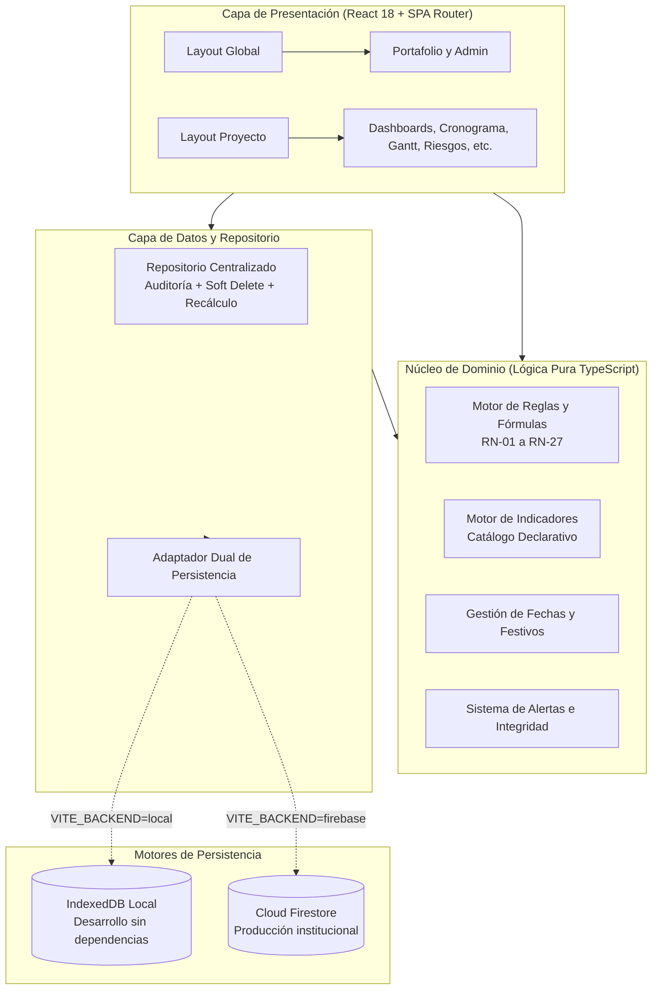

# HIGEP Web — Sistema de Gestión de Proyectos del IETS

[](./package.json)
[](https://react.dev/)
[](https://www.typescriptlang.org/)
[](https://vitejs.dev/)
[](https://www.iets.org.co/)
[]()

> **HIGEP Web** es la plataforma institucional multiproyecto del **Instituto de Evaluación Tecnológica en Salud (IETS)** para la planificación, gobierno, seguimiento operativo, control presupuestal, auditoría y lectura gerencial de los proyectos de evaluación de tecnologías sanitarias, guías de práctica clínica y estudios de efectividad clínica y económica.
>
> Reemplaza y supera integralmente la herramienta histórica basada en hojas de cálculo (**HIGEP V2**, libro de 17 pestañas), preservando su rigor metodológico y subsanando sus limitaciones de concurrencia, integridad referencial, seguridad por rol y consolidación en tiempo real.

---

## 📑 Tabla de Contenido

1. [Objetivos y Problemas que Resuelve](#1-objetivos-y-problemas-que-resuelve)
2. [Arquitectura del Sistema](#2-arquitectura-del-sistema)
3. [Estructura del Repositorio](#3-estructura-del-repositorio)
4. [Módulos Funcionales del Sistema](#4-módulos-funcionales-del-sistema)
5. [Motor de Reglas de Negocio y Cálculo](#5-motor-de-reglas-de-negocio-y-cálculo)
6. [Seguridad y Matriz de Roles (RBAC)](#6-seguridad-y-matriz-de-roles-rbac)
7. [Sistema de Diseño y Guía UX/UI](#7-sistema-de-diseño-y-guía-uxui)
8. [Instalación y Puesta en Marcha](#8-instalación-y-puesta-en-marcha)
9. [Modos de Persistencia (Local y Cloud)](#9-modos-de-persistencia-local-y-cloud)
10. [Exportación e Importación de Datos](#10-exportación-e-importación-de-datos)
11. [Defectos del Excel Histórico Subsanados](#11-defectos-del-excel-histórico-subsanados)

---

## 1. Objetivos y Problemas que Resuelve

### 1.1. Matriz de Problemas Resueltos (P1 a P8)

| # | Limitación en HIGEP V2 (Excel) | Solución implementada en HIGEP Web |
|---|---|---|
| **P1** | **Un archivo aislado por proyecto**: Imposibilidad de consolidar un portafolio institucional en vivo. | **Modelo multiproyecto centralizado** con vista transversal de portafolio y KPIs institucionales. |
| **P2** | **Sobrescritura accidental de fórmulas**: Las celdas de cálculo podían ser alteradas manualmente. | **Motor de cálculo desacoplado y protegido**: el usuario registra insumos, nunca fórmulas. |
| **P3** | **Trazabilidad manual**: Hoja *Registro de actualizaciones* diligenciada por voluntad humana. | **Auditoría inmutable append-only automática**: cada cambio registra usuario, campo, valor anterior y nuevo. |
| **P4** | **Sin control de acceso**: Cualquier persona con el archivo tenía permisos totales sobre la información. | **Control de acceso basado en roles (RBAC)** y autenticación restringida al dominio `@iets.org.co`. |
| **P5** | **Bloqueo por concurrencia**: Archivo bloqueado cuando un usuario lo tenía abierto en red. | **Escritura concurrente multiusuario** con soporte reactivo y transaccional. |
| **P6** | **Versiones divergentes**: Dispersión de copias en correos, discos locales y carpetas compartidas. | **Fuente única de verdad** garantizada por base de datos unificada. |
| **P7** | **Fecha de corte y avance desincronizados**: Cálculos desfasados por falta de refresco. | **Fecha de corte única por proyecto** que dispara recálculo automático de todo el cronograma e hitos. |
| **P8** | **Tableros estáticos**: Gráficas dependientes de macros o de recálculos manuales en Excel. | **Dashboards interactivos en tiempo real**: mapas de calor, avance ponderado y semaforización. |

### 1.2. Principios Funcionales No Negociables

1. **Unicidad del registro:** Cada dato se registra en el módulo que le corresponde; no existe duplicidad de captura.
2. **Inalterabilidad de cálculos:** Los campos derivados (duraciones, estados, severidad, semáforos) no son editables por el usuario.
3. **Fecha de corte soberana:** Todo el estado de avance, retrasos y semaforizaciones se evalúa estrictamente contra la fecha de corte configurada en la Ficha del Proyecto.
4. **Trazabilidad total:** Ninguna mutación relevante ocurre en silencio; todo evento sensible genera registro de auditoría.
5. **Gobierno por listas controladas:** Las opciones desplegables provienen de catálogos gestionados; no se permiten cadenas de texto libre en clasificaciones formales.
6. **Integridad del tablero:** Un indicador o gráfica gerencial jamás se manipula directamente: se corrige el dato primario que lo alimenta.

---

## 2. Arquitectura del Sistema

El sistema implementa una arquitectura desacoplada basada en el patrón de **Puertos y Adaptadores (Arquitectura Hexagonal)**, garantizando que el núcleo de dominio y las reglas de negocio sean completamente independientes del motor de almacenamiento subyacente.



### 2.1. Decisiones de Arquitectura (ADR)

- **ADR-01 (SPA en React):** Interfaz fluida para módulos con alta densidad de interacción (diagramas de Gantt, edición de tablas masivas, mapas de calor de riesgos).
- **ADR-02 (Persistencia Dual):** Soporte inmediato para **modo local autónomo** (vía IndexedDB con datos sintéticos sembrados) y **modo corporativo** (vía Google Cloud / Firebase Firestore).
- **ADR-06 (Auditoría Append-Only):** Registro histórico inmutable de eventos. Cada escritura descompone las diferencias entre el estado previo y el nuevo.
- **ADR-07 (Catálogos Parametrizables):** Listas controladas y parámetros de tolerancia alojados en datos, permitiendo mantenimiento administrativo sin despliegue de código.
- **ADR-08 (Catálogo Declarativo de Indicadores):** Reglas de semaforización y metas parametrizadas sin cablear fórmulas en vistas.
- **ADR-09 (Baja Lógica / Soft Delete):** Ninguna entidad de negocio se elimina físicamente; se marca como eliminada para preservar coherencia histórica y trazabilidad.

---

## 3. Estructura del Repositorio

```text
Sistema de Gestion de Proyectos del IETS/
├── HIGEP_Web_Backlog_Tecnologico.md   # Especificación técnica, reglas (RN) y épicas (EP)
├── linea-grafica-y-ux-ui.md          # Sistema de diseño, guía UX/UI y tokens visuales
├── README.md                         # Este documento de arquitectura y guía
├── docs/                             # Documentación técnica adicional y diagramas
├── functions/                        # Cloud Functions (backend serverless para Firebase)
└── frontend/                         # Aplicación Web cliente (React + TypeScript + Vite)
    ├── index.html                    # Entrada HTML principal
    ├── vite.config.ts                # Configuración del empaquetador Vite
    ├── tsconfig.json                 # Configuración de compilación TypeScript estricta
    ├── package.json                  # Dependencias y scripts del proyecto
    ├── .env.example                  # Plantilla de variables de entorno
    ├── .env                          # Variables activas (local / producción)
    └── src/
        ├── main.tsx                  # Punto de montaje React DOM
        ├── App.tsx                   # Enrutador principal y proveedor de estado
        ├── app/                      # Shell de aplicación y navegación
        │   ├── LayoutGlobal.tsx      # Layout institucional (sidebar general + header)
        │   ├── LayoutProyecto.tsx    # Layout de proyecto (fecha de corte + submenús)
        │   ├── ProyectoContext.tsx   # Estado global del proyecto activo
        │   └── navegacion.tsx        # Mapa único de navegación institucional y de proyecto
        ├── auth/                     # Autenticación y Autorización
        │   ├── AuthContext.tsx       # Proveedor de sesión y conmutación de roles demo
        │   └── permisos.ts           # Matriz RBAC (rol x acción) y guardas de seguridad
        ├── components/               # Sistema de diseño de componentes reutilizables
        │   ├── Header.tsx            # Barra superior institucional y perfil de usuario
        │   ├── Sidebar.tsx           # Menú lateral con badges de conteo y alertas
        │   ├── Card.tsx              # Tarjetas de contenido elevadas
        │   ├── Button.tsx            # Botón institucional multivariante (guía 6.1)
        │   ├── Badge.tsx             # Etiquetas de estado semánticas
        │   ├── Alert.tsx             # Avisos contextuales y banners informativos
        │   ├── Toast.tsx             # Notificaciones efímeras accesibles
        │   ├── Progreso.tsx          # Barras de progreso y semáforos de avance
        │   ├── EstadoVista.tsx       # Vistas de carga, error y estado vacío
        │   ├── Dashboard/KPICard.tsx # Tarjetas KPI de métricas clave con acentos
        │   ├── charts/               # Componentes gráficos y mapa de calor matricial
        │   ├── icons/                # Iconografía vectorial unificada (24x24 SVG)
        │   └── ui/                   # Controles de formulario accesibles
        │       ├── Field.tsx         # Inputs, Selects, Textareas y Checkboxes
        │       ├── Modal.tsx         # Diálogos modales y confirmaciones destructivas
        │       └── Table.tsx         # Tabla corporativa con ordenamiento y estados
        ├── domain/                   # LÓGICA DE NEGOCIO PURA (independiente de UI)
        │   ├── types.ts              # Modelos de datos TypeScript (entidades y tipos)
        │   ├── reglas.ts             # Reglas de negocio críticas (RN-01 a RN-27)
        │   ├── indicadores.ts        # Fórmulas de cálculo de los 10 indicadores institucionales
        │   ├── catalogos.ts          # Listas controladas y parámetros por defecto
        │   ├── fechas.ts             # Motor de días hábiles, festivos colombianos y rangos
        │   └── alertas.ts            # Centro unificado de alertas e integridad
        ├── data/                     # CAPA DE ACCESO A DATOS Y ADAPTADORES
        │   ├── adapter.ts            # Interfaces del adaptador y generador de rutas
        │   ├── backend.ts            # Fábrica de backend (detección local vs firebase)
        │   ├── localAdapter.ts       # Adaptador IndexedDB para desarrollo offline
        │   ├── firebaseAdapter.ts    # Adaptador Cloud Firestore para producción
        │   ├── repo.ts               # Fachada de repositorio con auditoría y recálculo
        │   ├── auditoria.ts          # Calculador de diferencias (diff) y eventos
        │   └── seed.ts               # Sembrado de datos sintéticos de demostración
        ├── lib/                      # Utilidades transversales
        │   ├── formato.ts            # Formateadores de moneda, porcentaje y fechas
        │   └── exportar.ts           # Motor de exportación/importación Excel y CSV
        ├── modules/                  # PANTALLAS Y MÓDULOS DE NEGOCIO
        │   ├── Login.tsx             # Pantalla de acceso y selector de cuentas demo
        │   ├── portafolio/           # Vista gerencial consolidada de todos los proyectos
        │   ├── dashboard/            # Dashboard Ejecutivo del proyecto activo
        │   ├── tablero/              # Tablero de seguimiento y alertas operativas
        │   ├── proyectos/            # Directorio de proyectos y Ficha técnica
        │   ├── equipo/               # Grupo desarrollador, vinculaciones y dedicación
        │   ├── cronograma/           # Cronograma tabular con cálculo de duraciones
        │   ├── gantt/                # Diagrama visual de barras temporales
        │   ├── hitos/                # Hitos, ruta crítica y control de entregables
        │   ├── raci/                 # Matriz de asignación de responsabilidades
        │   ├── riesgos/              # Matriz de riesgos y mapa de calor 5x5
        │   ├── recursos/             # Registro de insumos y recursos por gestionar
        │   ├── productos/            # Control de calidad de entregables comprometidos
        │   ├── satisfaccion/         # Mediciones periódicas de partes interesadas
        │   ├── presupuesto/          # Control de ejecución presupuestal y desviaciones
        │   ├── indicadores/          # Panel de indicadores calculados del proyecto
        │   ├── auditoria/            # Consulta de eventos (global y por proyecto)
        │   ├── catalogos/            # Módulos de administración del sistema
        │   │   ├── Catalogos.tsx     # Listas controladas, parámetros y festivos
        │   │   ├── CatalogoIndicadores.tsx # Catálogo institucional de indicadores
        │   │   └── Usuarios.tsx      # Directorio de usuarios y perfiles
        │   └── importacion/          # Importación y exportación de libros HIGEP V2
        └── styles/                   # ESTILOS GLOBALES Y TOKENS
            ├── theme.ts              # Tokens TypeScript (colores, espaciado, sombras)
            ├── globals.css           # Estilos base y variables CSS nativas
            └── components.css        # Clases de utilidad y componentes de diseño
```

---

## 4. Módulos Funcionales del Sistema

El sistema cubre el 100 % del flujo metodológico de HIGEP, organizado en 5 bloques de navegación:

```text
HIGEP Web
├── 🏛️ NIVEL INSTITUCIONAL
│   ├── Portafolio: Consolidado de proyectos, avance global, riesgos críticos y alertas.
│   ├── Auditoría del Sistema: Registro transversal de cambios y eventos de configuración.
│   └── Administración:
│       ├── Catálogos y Parámetros: Listas controladas, umbrales y calendario de festivos.
│       ├── Catálogo de Indicadores: Metas institucionales, fuentes y fórmulas de semáforos.
│       └── Usuarios y Roles: Cuentas institucionales y asignación de permisos globales.
│
└── 📁 NIVEL PROYECTO (Contextualizado al proyecto activo)
    ├── 1. Lectura Gerencial
    │   ├── Dashboard Ejecutivo: Visión de alto nivel, avance ponderado vs. esperado y alertas.
    │   ├── Tablero de Seguimiento: Semáforo de actividades, curva S y distribución por fase.
    │   └── Indicadores: Resultados calculados de los 10 indicadores institucionales.
    ├── 2. Definición
    │   ├── Ficha del Proyecto: Objetivos, alcance, fechas clave y fecha de corte soberana.
    │   └── Grupo Desarrollador: Equipo humano, roles, dedicación en horas-mes y vinculación.
    ├── 3. Planeación
    │   ├── Cronograma: Actividades por fase, responsables, duraciones en días hábiles y avance.
    │   ├── Diagrama de Gantt: Visualización cronológica de barras según calendario de corte.
    │   └── Hitos y Ruta Crítica: Hitos comprometidos, fechas programadas/reales y holguras.
    ├── 4. Gobierno y Control
    │   ├── Matriz RACI: Matriz de responsabilidades con validación de integridad (exactamente 1 Accountable).
    │   ├── Matriz de Riesgos: Matriz 5x5, cálculo de severidad, mapa de calor y planes de mitigación.
    │   └── Recursos e Insumos: Requerimientos técnicos, logísticos y humanos por gestionar.
    ├── 5. Medición y Trazabilidad
    │   ├── Registro de Productos: Conformidad y evaluación formal de entregables comprometidos.
    │   ├── Medición de Satisfacción: Encuestas y retroalimentación de partes interesadas.
    │   ├── Control Presupuestal: Programado vs. ejecutado y cálculo automático de desviaciones.
    │   ├── Auditoría del Proyecto: Historial cronológico de cambios de este proyecto.
    │   └── Importar y Exportar: Descarga consolidada a Excel/CSV e importación de libros HIGEP V2.
```

---

## 5. Motor de Reglas de Negocio y Cálculo

Las reglas están centralizadas en [`src/domain/reglas.ts`](./frontend/src/domain/reglas.ts) e [`src/domain/indicadores.ts`](./frontend/src/domain/indicadores.ts):

### 5.1. Reglas Operativas Principales

- **RN-01 (Estado de la Actividad):** Calculado de manera determinística según fecha de corte, fechas extremas y avance:
  - Si `avance == 100%` $\rightarrow$ **Completada**.
  - Si `avance < 100%` y `fechaFin < fechaCorte` $\rightarrow$ **Retrasada**.
  - Si `fechaInicio <= fechaCorte` y `avance < 100%` $\rightarrow$ **En curso**.
  - Si `fechaInicio > fechaCorte` y `avance == 0%` $\rightarrow$ **Pendiente**.
- **RN-02 (Días Hábiles Reales):** La duración excluye fines de semana (sábados y domingos) y días no laborables del calendario nacional de Colombia (`festivosRango`).
- **RN-05 (Avance Ponderado del Proyecto):**
  $$\text{Avance Ponderado} = \frac{\sum (\text{Avance}_i \times \text{Duración}_i)}{\sum \text{Duración}_i}$$
- **RN-06 (Desviación y Umbrales):**
  $$\text{Desviación} = \text{Avance Ponderado Real} - \text{Avance Esperado}$$
  - Desviación dentro de $\pm 5\%$ $\rightarrow$ Normal (**Verde**).
  - Desviación entre $-5\%$ y $-10\%$ $\rightarrow$ Precaución (**Amarillo**).
  - Desviación inferior a $-10\%$ $\rightarrow$ Crítico / Atención (**Rojo**).
- **RN-12 y RN-13 (Severidad y Nivel de Riesgo):**
  $$\text{Severidad} = \text{Probabilidad (1..5)} \times \text{Impacto (1..5)}$$
  - Severidad 1–4: **Bajo** | 5–9: **Medio** | 10–14: **Alto** | 15–25: **Crítico**.
- **RN-17 a RN-19 (Integridad RACI):** Cada actividad debe tener **exactamente un responsable directo** (*A - Accountable*). Se emite alerta de integridad si una actividad carece de *A* o tiene múltiples *A*.

### 5.2. Los 10 Indicadores Institucionales

1. **PRY-O001 (Cumplimiento de cronograma):** Actividades completadas a tiempo vs. programadas a la fecha de corte.
2. **PRY-O002 (Cumplimiento de entregables):** Hitos cumplidos en o antes de la fecha programada.
3. **PRY-O003 (Conformidad de productos):** Productos evaluados y declarados conformes.
4. **PRY-O004 (Satisfacción de partes interesadas):** Porcentaje promedio de satisfacción en encuestas.
5. **PRY-O005 (Desviación presupuestal):** Proporción de variación entre gasto programado y ejecutado.
6. **PRY-O006 (Eficiencia presupuestal):** Ejecución financiera ponderada contra avance físico.
7. **PRY-O007 (Efectividad del proyecto):** Índice compuesto entre avance de actividades y conformidad de productos.
8. **PRY-O008 (Gestión de recursos):** Recursos gestionados y disponibles vs. requeridos.
9. **RIES-001 (Índice de riesgo residual):** Densidad de riesgos no cerrados en niveles alto y crítico.
10. **RIES-002 (Eficacia de mitigación):** Proporción de riesgos materializados frente a los identificados.

---

## 6. Seguridad y Matriz de Roles (RBAC)

El acceso está gobernado por el principio de mínimo privilegio en [`src/auth/permisos.ts`](./frontend/src/auth/permisos.ts):

| Rol | Alcance | Capacidades |
|---|---|---|
| **Administrador** | Global | Control total: catálogos, parámetros, usuarios, asignación de roles y desbloqueo de proyectos. |
| **Líder de Proyecto** | Sus proyectos | Creación y edición integral del proyecto, gestión del equipo, cronograma, riesgos y cierre de proyecto. |
| **Gestor de Proyecto** | Sus proyectos | Apoyo operativo: registro de avance en cronograma, riesgos, recursos y presupuesto (sin editar ficha ni cerrar). |
| **Miembro del Equipo** | Asignaciones | Registro de avance propio en actividades asignadas y cargue de evidencias de cumplimiento. |
| **Directivo / Consulta** | Global | Lectura gerencial: portafolio institucional, dashboards ejecutivos y tableros sin capacidad de edición. |
| **Auditor** | Global | Acceso de lectura total, incluyendo el registro detallado de auditoría del sistema y de proyectos. |

---

## 7. Sistema de Diseño y Guía UX/UI

La aplicación implementa una línea gráfica moderna, sobria y accesible definida en [`linea-grafica-y-ux-ui.md`](./linea-grafica-y-ux-ui.md):

- **Paleta cromática:**
  - **Acento principal:** Púrpura institucional `#6366F1` (hover `#4F46E5`).
  - **Datos y navegación secundaria:** Azul corporativo `#3B82F6`.
  - **Semántica de estados:**
    - Éxito: `#10B981` (suave `#D1FAE5`)
    - Advertencia / Precaución: `#F59E0B` (suave `#FEF3C7`)
    - Error / Crítico: `#EF4444` (suave `#FEE2E2`)
    - Informativo: `#3B82F6` (suave `#DBEAFE`)
  - **Fondos:** Fondo app `#F8FAFC`, tarjetas y paneles `#FFFFFF`.
- **Tipografía:** Pila tipográfica sans-serif neutra (*Inter*, stack del sistema operativo) con jerarquía estricta y cifras tabulares para tablas financieras y cronogramas.
- **Componentes unificados:** Estricta coherencia en botones, tarjetas KPI, tablas con cabecera de marca y modales de confirmación con justificación obligatoria de auditoría.

---

## 8. Instalación y Puesta en Marcha

### 8.1. Requisitos Previos

- **Node.js:** Versión 18.0.0 o superior (recomendado Node 20 LTS).
- **npm:** Versión 9.0.0 o superior.

### 8.2. Pasos de Instalación

1. **Clonar el repositorio:**
   ```bash
   git clone https://github.com/IETS-ColombiaDev/Sistema-de-Gestion-de-Proyectos-del-IETS.git
   cd "Sistema de Gestion de Proyectos del IETS"
   ```

2. **Instalar dependencias del frontend:**
   ```bash
   cd frontend
   npm install
   ```

3. **Configurar variables de entorno:**
   Crea o verifica el archivo `.env` en la raíz de `frontend/`:
   ```bash
   cp .env.example .env
   ```
   *Contenido para desarrollo local (por defecto):*
   ```ini
   VITE_BACKEND=local
   VITE_ALLOWED_DOMAIN=iets.org.co
   ```

4. **Iniciar el servidor de desarrollo:**
   ```bash
   npm run dev
   ```
   La aplicación quedará disponible de inmediato en **[http://localhost:5173/](http://localhost:5173/)**.

### 8.3. Scripts Disponibles

En el directorio `frontend/`:

| Comando | Descripción |
|---|---|
| `npm run dev` | Inicia el servidor de desarrollo Vite con Hot Module Replacement (HMR). |
| `npm run build` | Ejecuta la comprobación TypeScript (`tsc -b`) y compila el paquete de producción en `dist/`. |
| `npm run typecheck` | Ejecuta la verificación de tipos estricta (`tsc --noEmit`) sin emitir archivos. |
| `npm run preview` | Previsualiza localmente el paquete generado en `dist/`. |
| `npm test` | Ejecuta la suite de pruebas unitarias con Vitest. |

---

## 9. Modos de Persistencia (Local y Cloud)

La aplicación soporta alternancia instantánea mediante la variable `VITE_BACKEND`:

### 9.1. Modo Local (`VITE_BACKEND=local`)
- **Almacenamiento:** Motor IndexedDB del navegador vía adaptador reactivo.
- **Sin dependencias externas:** No requiere conexión a internet, credenciales de Google Cloud ni servicios de pago.
- **Datos iniciales (Seed):** Si la base de datos está vacía, se siembran automáticamente datos sintéticos:
  - 3 proyectos de prueba con actividades, hitos, riesgos, recursos y presupuesto.
  - Cuentas de usuario de prueba para alternar roles sin autenticación real:
    - `admin.sistema@iets.org.co` (Administrador)
    - `lider.proyecto@iets.org.co` (Líder)
    - `gestor.proyecto@iets.org.co` (Gestor)
    - `analista.uno@iets.org.co` (Miembro)
    - `director.tecnico@iets.org.co` (Directivo)
    - `auditor.calidad@iets.org.co` (Auditor)

### 9.2. Modo Cloud / Producción (`VITE_BACKEND=firebase`)
- **Almacenamiento:** Google Cloud Firestore con réplica multirregión.
- **Autenticación:** Firebase Authentication con Google Sign-In restringido a cuentas `@iets.org.co`.
- Requiere configurar las credenciales en el archivo `.env`:
  ```ini
  VITE_BACKEND=firebase
  VITE_FIREBASE_API_KEY=tu_api_key
  VITE_FIREBASE_AUTH_DOMAIN=tu_proyecto.firebaseapp.com
  VITE_FIREBASE_PROJECT_ID=tu_project_id
  VITE_FIREBASE_STORAGE_BUCKET=tu_proyecto.appspot.com
  VITE_FIREBASE_MESSAGING_SENDER_ID=tu_sender_id
  VITE_FIREBASE_APP_ID=tu_app_id
  ```

---

## 10. Exportación e Importación de Datos

Ubicado en la ruta `/proyectos/:proyectoId/importacion`:

1. **Exportación Total a Excel (.xlsx):**
   - Genera un libro multihoja idéntico a la estructura de HIGEP V2: Ficha, Cronograma, Hitos, Equipo, Riesgos, Recursos, Productos, Presupuesto y Satisfacción.
2. **Exportación Modular a CSV:**
   - Descarga individual de tablas de cronograma, riesgos y presupuesto con codificación UTF-8 con BOM compatible con Microsoft Excel en español.
3. **Importación Inteligente con Prevalidación (HG-151):**
   - El usuario carga su archivo `.xlsx`.
   - El sistema analiza los nombres de pestañas y detecta automáticamente actividades, hitos y matrices de riesgos.
   - Emite un **informe de diagnóstico previo** con conteo de filas válidas y advertencias antes de tocar la base de datos.
   - Al confirmar, ejecuta una incorporación transaccional y recalcula en vivo todos los indicadores del proyecto.

---

## 11. Defectos del Excel Histórico Subsanados

Durante el análisis del libro original HIGEP V2 se identificaron y corrigieron formalmente 18 discrepancias y defectos de diseño:

- **D-01 (Fórmulas circulares o frágiles):** Sustituidas por motor funcional determinístico en TypeScript.
- **D-04 (Fecha de corte duplicada y desincronizada):** En el Excel coexistían fechas de corte en la carátula y en la hoja de parámetros. HIGEP Web establece **una única fecha de corte soberana por proyecto**.
- **D-07 (Vocabulario divergente de hitos):** En el libro anterior los hitos manejaban estados contradictorios entre tablas y dashboards. Se unificó a una lista controlada formal de 5 estados.
- **D-08 (Taxonomías de fases en conflicto):** El libro original presentaba dos listas distintas de fases entre el catálogo y el tablero de avance. En HIGEP Web la lista de fases es única y administrable por proyecto.
- **D-14 (Errores `#¡VALOR!` en filas vacías):** Tratamiento estricto de nulos sin romper agregaciones estadísticas.
- **D-17 (Omisión de indicadores de riesgo):** El instructivo solo describía 8 indicadores, pero el libro tenía fórmulas para 10. Se incorporaron formalmente `RIES-001` y `RIES-002`.

---

## 👥 Créditos Institucionales

- **Entidad:** Instituto de Evaluación Tecnológica en Salud — IETS Colombia.
- **Herramienta de Referencia:** HIGEP V2 (Herramienta Institucional para la Gestión de Proyectos).
- **Desarrollo Tecnológico:** Equipo de Ingeniería y Transformación Digital.
